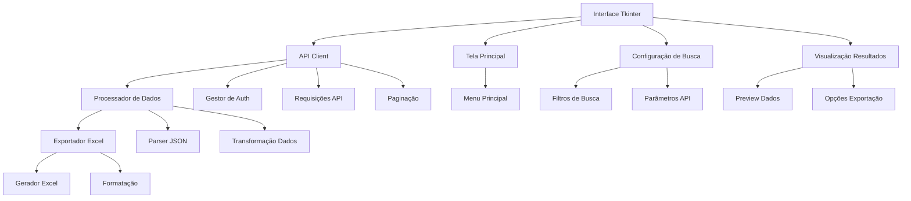

# Plano de Implementação - Scraper Meta Ads Library

## Visão Geral
Script Python para extrair dados da API da Meta Ads Library com interface gráfica Tkinter e exportação para Excel.

## Arquitetura



## Estrutura do Projeto

```
scraper_ads/
├── src/
│   ├── __init__.py
│   ├── gui/
│   │   ├── __init__.py
│   │   ├── main_window.py
│   │   ├── search_frame.py
│   │   ├── results_frame.py
│   │   └── styles.py
│   ├── api/
│   │   ├── __init__.py
│   │   ├── client.py
│   │   └── auth.py
│   ├── data/
│   │   ├── __init__.py
│   │   ├── processor.py
│   │   └── excel_export.py
│   └── utils/
│       ├── __init__.py
│       └── config.py
├── assets/
│   └── icons/
├── .env
├── requirements.txt
└── main.py
```

## Componentes Principais

### 1. Interface Gráfica (Tkinter)
- Tela principal com:
  - Campo para token de acesso
  - Seletores para parâmetros de busca:
    - Tipo de anúncio (ad_type)
    - Países (ad_reached_countries)
    - Palavras-chave (search_terms)
    - Datas (ad_delivery_date_min/max)
    - Plataformas (publisher_platforms)
  - Botão para executar busca
  - Área de preview dos resultados
  - Opções de exportação Excel

### 2. Cliente API
- Gerenciamento de autenticação
- Construção de queries
- Tratamento de paginação
- Gestão de rate limiting
- Tratamento de erros

### 3. Processador de Dados
- Parser de resposta JSON
- Transformação de dados
- Cache de resultados
- Validação de dados

### 4. Exportador Excel
- Múltiplas abas:
  - Dados Básicos
  - Métricas
  - Demografia
  - Configurações da Busca
- Formatação condicional
- Filtros automáticos
- Gráficos resumo

## Fluxo de Uso
1. Usuário inicia aplicação
2. Configura token de acesso
3. Seleciona parâmetros de busca
4. Executa busca
5. Visualiza preview dos dados
6. Ajusta parâmetros se necessário
7. Exporta para Excel

## Dependências
- tkinter
- requests
- pandas
- openpyxl
- python-dotenv
- pillow